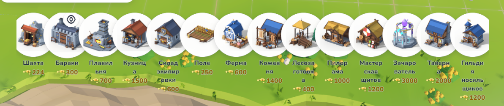
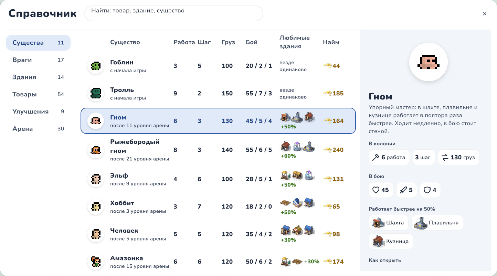
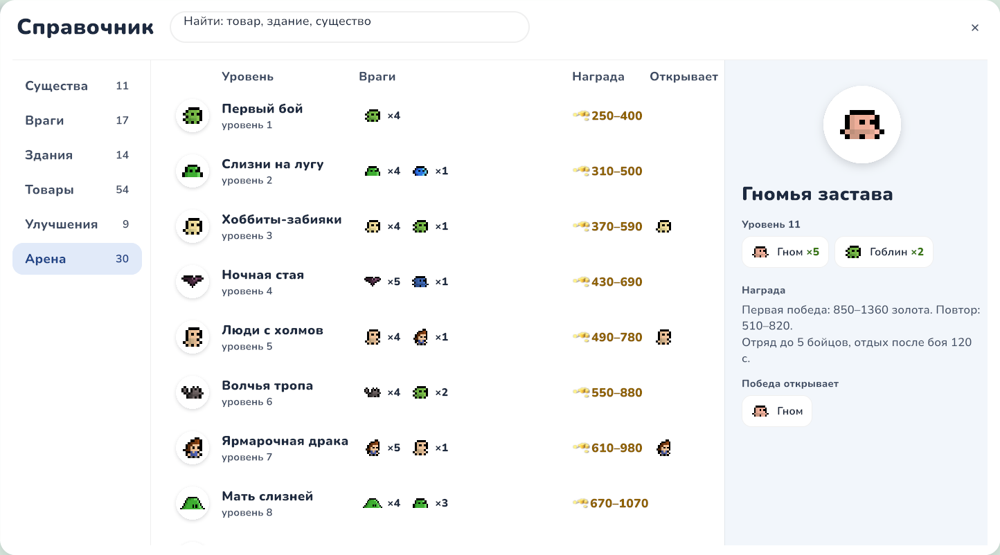
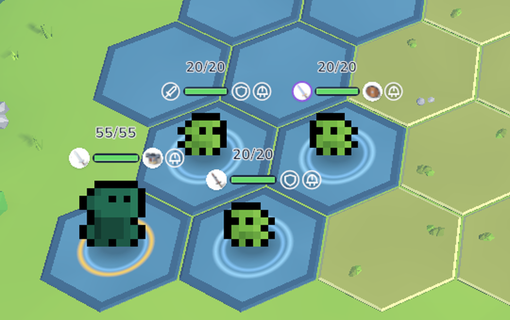
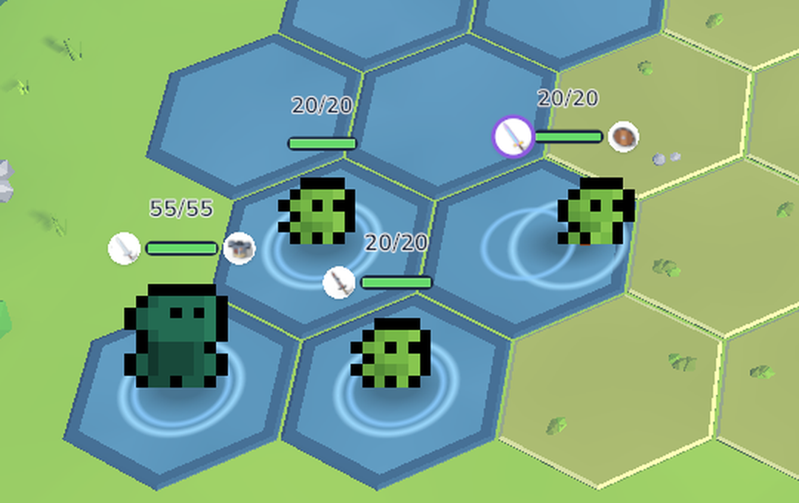
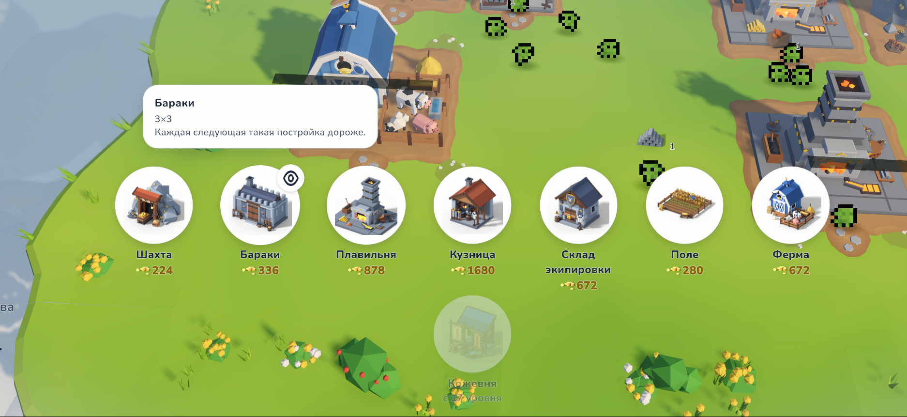
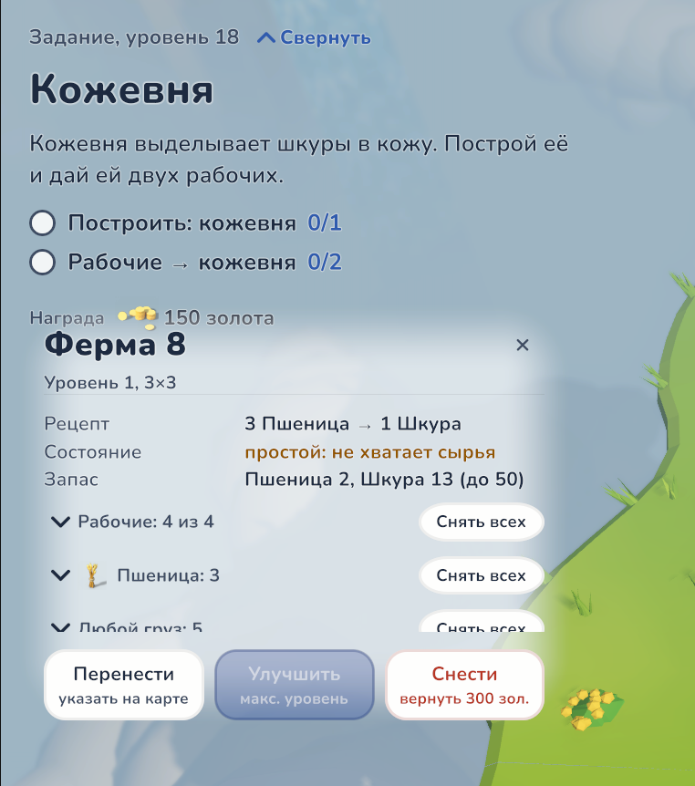
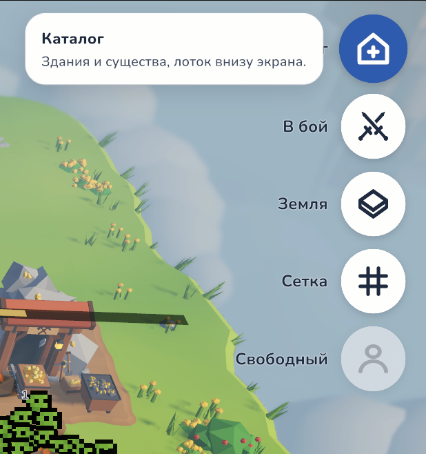
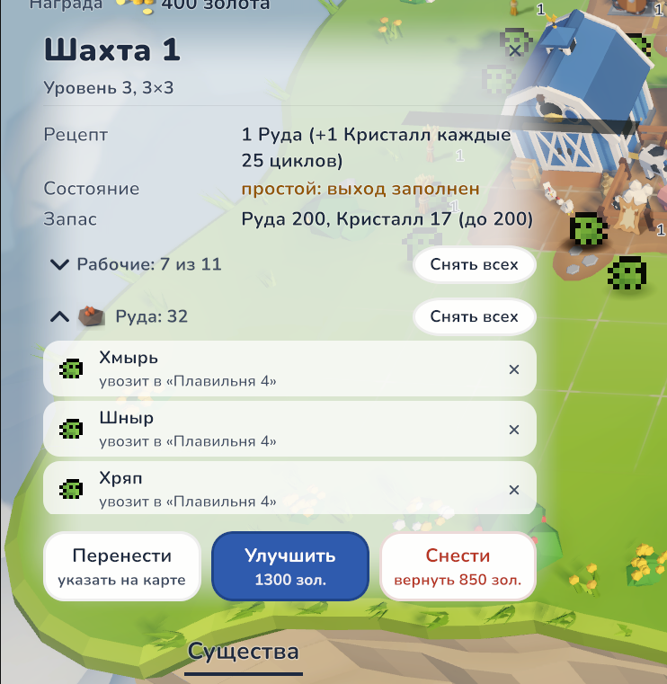
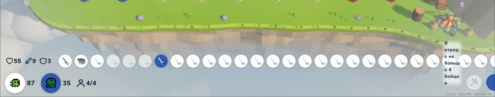

# Задачи после плейтеста — 2026-10-01

- [x] 1. Здания добывают ресурсы слишком быстро, из за этого нет нужны снабжать их работниками 1 шахта сейча покрывает несколько плавильн при этом там работают 3 работника и улучшать даже как будто и не хочется. Пересмотреть скорость производства всех.
- [x] 2. Не понятно зачем нужна ферма и барак. Надо думать что с ними делать.
- [x] 3. Шахта кристалы должна спавнить рандомного и не нужно указывать что через 25 ходок просто с шансом определнным не высоким.
- [x] 4. Задания по продаже слишком маленькие. Можно смело увеличивать х2
- [x] 5. Вместимость ресурсов в зданиях уменьшить х2-х3
- [ ] 6. Во время игры нет зданий по прохождению боев. Нет прогресс арены совсем. Забыли об этом. Мало того пользователь должен иметь возможность зарабатывать на арене к примеру нужно ввести кд пару минут после боя чтоб игрок мог вернуть к этой же арене и зафармить ее еще раз и получить деньги.
- [x] 7. Нет улучшений для большенства зданий
- [x] 8. Нет обучения или задания для покупки новой зоны
- [x] 9. Для первого входа в игру аниацию камеры
- [x] 10 Начать игру с начала
- [x] 11. Нет настроек игры меню паузы настройки звука графики (автоопределния графики) звука музыки Языка Об авторе
- [x] 12. Нет вводного окна что это альфа тест игры и тд как в других моих играх к примеру   Vitaria F:\ClaudeGames\strategy1
- [x] 13. Под мобилки как будто нужно другой UI этот плохо видно
- [x] 14. Рассмотреть возможность упрощения UI в целом.
- [x] 15. Нужно рассмортеть что б у нас в 1 здании было несколько производство. К примеру шахта железо кристалы с редким шансом и что то еще при улучшении или поле может произвести редкую пшеницу или кузница может сломать а не сковать и будет отход производтсват. Для каждой придумать по несколько штук и как и применять и как внедрять в игру.
- [x] 16. На арене когда даешь юниту оружие или броню не понятно что он ее надел нужно как то на нем ее отображать
- [x] 17. Когда появляется в UI слишком много зданий нужно их горизонтально скроллить
- [x] 18. Иногда UI заданий наезжает на UI зданий
- [x] 19. Нужно уменьшить изначальное скорость перемещения юнитов. И добавить какое то здание где мы сможем улучшать их. Скорость перемещения Скоро принять ресурс отдать ресурс Сколько носить можно за раз.
- [x] 20. Добавить больше юнитов в игру из папки со спрайтами F:\ClaudeGames\trollstrategy\assets\sprites\Minifantasy_Creatures_Assets желательно всех. Потом придумаем что где использовать. Может какой то тип юнитов будет лучше работать в определенном здании к примеру
- [x] 21. Перевести игру на англ каз японский корейский китайский немецкий франс италь испанский индийский польский чешский  и еще какие там популярны языки есть
- [x] 22. На всех иконки верхнего правого угла назначать горячие клавиши
- [x] 23. Сейчас достаточно скучные цепочки поизводства а это ВАЖНО! То есть у нас сейчас как? Условно есть пшеница, пшеница в скотоферму, скотоферма в кожу, кожа там, не помню, куда идет. Вроде никуда дальше. А проблема в том, что это очень скучно. Хотелось бы, чтобы было одно здание. куда привозилось там и то, и другое, два там или три, четыре, пять, несколько элементов. Потом из этого выстраивалось уже цепочка типа более сложная.
- [x] 24. Но в данный момент большинство заданий, они, они однотипны. Типа, построй это, найми столько-то людей, и продай столько-то вещей. Заработай столько-то денег. Нужно подумать, как это можно все разнообразить.
- [x] 25. Сейчас когда за рудой очередь больше 32 сборщиком нереальная очередь. Нужно так же построить здание которое будут отвечать за улучшения этих параметор Время выдачи сколько в очереди макс стоит и тд
- [x] 26. UI снаяржения на арене из за большого кол ва оружия стал тупить скрин прикрепил
- [x] 27. Если нажать на юнита который несет какой то товар то надо показывать стоимость товара которые он несет там где мы показываем горячие клавиши
- [x] 28. Бои на арене должны меняться. Это должны быть миссии который игрок может выбирать. Короче, идея в чем заключается? У нас есть первый уровень арены, игрок может к нему вернуться в любой момент, чтобы перепройти. Перепроходит арену, начинается таймер, там 2 минуты, к примеру. И он может хоть бесконечное количество раз проходить один и тот же. Но чтобы он прогрессировать по аренам, увеличивать там цену, сложность противников, количество своих юнитов, которых он может размещать, это все нужно делать прогрессивно. То есть один уровень, второй, третий, четвертый, пятый, там двадцатый, тридцатый. Потом мы будем менять окружение, мы подключим новых юнитов, будут встречаться новые юниты. Новое количество юнитов, новая сила юнитов, новая расположение их. И так далее.
- [x] 29. Нужно придумать как можно прокачивать улучшения для арены через какое здание и как это может сказаться на игре в лучшую сторону
- [x] 30. Кол во имен нужно расширить
- [x] 31. При выборе свободного работника надо переносить камеру к нему

---

# Проверка (2026-10-02)

Ответ после проверки — дословно.

1. Нужно тестировать дольше
2. Нужно думать дальше над этим
3. Нормально. Потом подкорректируем когда будем править баланс
4. Принято
5. Будем править во время баланса игры
6. Для прогресси боев нужно отдельное SDD делать задача не закрыта
7. Вижу пофиксил
8. Есть
9. Есть
10. Есть
11. Есть. Но нужно проверить действильно ли применяются настройки
12. Есть
13. Это обсуждаем дальше
14. Это обсуждаем дальше
15. Это обсуждаем дальше
16. Отображается но очень криво. Нужно пересмотрть 3 варианта
17. Переделали еще раз
18. Есть баг что ели задание видно и открыть здание то UI задания скрывает и потом не может быть открытм. Фикси
19. Нужно тестить мне больше
20. Юнитов вижу. Пока применение не понятно.
21. Вижу переводы не вижу чтоб они применялись
22. Есть
23. Это обсуждаем дальше
24. Задания новые вижу. Отпишусь после более подробного теста
25. Здание не нашел. Так же не нашел тутора на эту механику.
26. Не могу пока проверить
27. Не выполнено
28. Это обсуждаем дальше
29. Это обсуждаем дальше
30. Есть
31. Есть

## Новые замечания

- [x] Н1. У построек во вкладке Здания слишком подробоное описание нужно описывать только базовые ресурсы и скролл выглядит не красиов нужно 3 варианта
- [x] Н2. Так же описание производственных цепочек в окне награды за задание не понятно
- [x] Н3. Нужно реализовать кнопку с вики со всеми юнитами их характеристика зданиями улучшениями из цепочками ресурсами ценами дай 3 варианта UI



## Сделано по проверке (2026-10-02, вечер)

Код скомпилирован офлайн. Unity-тесты, setup-меню, боты и сборка ещё не прогнаны: редактор проекта был открыт.

- **11. Графика ничего не меняла.** Все 6 уровней качества указывали на один URP-ассет, а URP читает только его. `Editor/Setup/GraphicsQualitySetup` (меню `TrollStrategy/Dev/Setup Graphics Quality`, входит в Setup Everything) делает `UniversalRP_Low` и `UniversalRP_Medium` из основного ассета: меньше MSAA, карта теней и каскады; разрешение и HDR те же. Звук и размер интерфейса применялись и раньше. Тест `GraphicsQualityTests`.
- **18. Задание не разворачивалось.** Пока открыта карточка здания, задание сворачивалось заново на каждом обновлении. Теперь сворачивается только в момент открытия карточки, кнопка «Развернуть» работает. Тест `QuestCard_FoldsForABuildingCard_AndOpensWhenThePlayerAsks`.
- **21. Переводы не применялись.** В сцене у `GameBootstrap` пропала ссылка на `Languages.asset` (сцену пересохранили без неё). Ссылка возвращена; `UiSetup` теперь ставит её при каждой пересборке UI; тест сцены это проверяет.
- **25. Гильдию не найти.** Гильдия открывалась после 10-го задания. Теперь — сразу после «Новой земли», задание объясняет, где она и какие два улучшения купить. Текст переведён на 15 языков.
- **27. Цену груза не видно.** Строка была мелким серым текстом под именем. Теперь над кнопками приказов значок: товар ×N и монета с ценой. Тест `SelectedHauler_ShowsItsLoadAndWhatItFetches_OverTheOrders`.
- **Н1 (описание).** Подсказка здания в каталоге — только главный рецепт (самый простой рецепт 1-го уровня), размер и рабочие. Шансы, брак и рецепты уровней — в карточке здания. Тест `Catalog_BuildingHint_NamesOnlyTheMainRecipe`.
- **Н2.** Окно награды за здание показывает цепочку строками: размер и рабочие, «Делает»/«Добывает», «Откуда сырьё» и «Куда товар» с картинками зданий, «Иногда» (шансы), «Брак», число остальных рецептов.
- **16, Н1 (прокрутка), Н3.** Три варианта на каждый, отдельной страницей на пункт, поверх настоящих кадров игры: «Снаряжение на бойце», «Каталог зданий», «Справочник игры». Ждут выбора.
- **Н1, имена по буквам.** Причина — жетон каталога сжимался в прокручиваемом ряду (ошибка правки к 17). У `.token` теперь `flex-shrink: 0`.
- **Тесты после прогона в редакторе (17:43).** Упали 4 новых теста: тест графики ждёт `Setup Graphics Quality`; в окне награды не находился рынок (он не строится, а код отбрасывал непостраиваемые здания раньше времени) — исправлено; в двух тестах карточку здания закрывал не тот вызов и группа выделялась из одного носильщика — тесты исправлены.
- **6.** Нужна отдельная спека (SDD) на прогрессию боёв — не начата.

## Выбор вариантов и реализация (2026-10-02, вечер)

Выбрано: **16А** (жетоны у полосы здоровья, с учётом шлема), **Н1А** (страницы по восемь), **Н3А** (книга на весь экран).

- **16А.** Жетоны снаряжения в панели полосы здоровья: оружие слева, броня и шлем справа; пустые слоты пунктиром только при расстановке и только для слотов, под которые в игре есть предметы; фиолетовый обод у зачарованного (`EquipmentDefinition.Enchanted`); жетон оружия вспыхивает на ударе. Слот `EquipmentSlot.Helmet` добавлен, предметов-шлемов пока нет. Старые значки-спрайты рядом с бойцом убраны.
- **Н1А.** `CatalogPager`: восемь жетонов на страницу (меньше на узком экране), круглые стрелки по краям, точки страниц, синяя метка на стрелке и точке страницы с заданием, колесо мыши. Стрелки клавиатуры заняты камерой — листание кнопками и колесом.
- **Н3А.** `WikiPanel` (кнопка «Справочник», K): шесть разделов — существа, враги, здания, товары, улучшения, арена; таблица и страница записи; поиск по всем разделам; значок здания открывает здание. Колония на паузе, Esc закрывает. Связи «кто делает / кто берёт» — общий `ChainLinks` (им же пользуется окно награды).

Нужно в Unity: `TrollStrategy/Dev/Setup UI` (в префабе появится документ книги — до этого кнопки нет, игра работает), `Setup Graphics Quality`, `Setup All Content`, затем EditMode-тесты, боты и сборка.

### Проверка в Unity (2026-10-04)

- Setup Everything на проекте прошёл: в префабе UI появилась книга, задание «Гильдия носильщиков» стоит после «Новой земли», уровни графики получили свои URP-ассеты.
- EditMode на проекте: 441, упало 0, пропущено 4. На копии с тропами сессии f2: 458, упало 0, пропущено 4.
- Сборка Windows на копии проекта: успешно, 0 ошибок.
- По снимкам исправлено: таблицы книги рисовались со сдвигом (у списков отключена групповая трансформация), колонки и заголовки не помещались, подсказка в поиске не переводилась, описание здания склеивалось из кусков и не переводилось целиком, номер уровня арены дублировался в названии, на страницу каталога влезало 7 жетонов вместо 8, последняя страница сдвигала стрелки, жетоны снаряжения висели не у полосы здоровья и были мелкими.
- Проверка в Play Mode (копия проекта, вместе с тропами f2): колония, интерфейс и справочник собираются; справочник открывается, переходит к кузнице, ищет «кож» (кожевня, кожа, кожаная броня), закрывается по Esc; быстрый бой с тремя гоблинами идёт, на бойце со стартовым снаряжением — жетоны оружия и брони; ошибок и исключений — 0.
- Собранный плеер без окна не дописывает лог, поэтому его запуск проверен через Play Mode.

**Итог:** пункты 16, 18, 21, 25, 27 и Н1–Н3 закрыты. Пункт 6 (прогрессия боёв) открыт — по твоему решению это отдельная спека (SDD), в эту задачу не входит. Пункты с пометкой «обсуждаем дальше» и «тестить дальше» ждут твоих решений.








---

# Разбор (2026-10-02)

Ниже — состояние кода на коммите `44b3a92` и рабочем дереве. Пути от `unity/TrollStategy/Assets/Game/`.
Размер: **S** — до часа, **M** — день, **L** — несколько дней, **XL** — нужна отдельная спека.

## Итог реализации (2026-10-02)

Решения и устройство — `docs/backlog/implementation-plan-2026-10-02.md`, числа — `docs/economy-balance.md` §8–9.

1. Работа 0,1 → 0,06 за очко силы; ходьба ×0,8; погрузка 0,5 с, выгрузка 0,25 с, у двери 3 места. У всех производств появились уровни.
2. Ферма ест пшеницу и солому, даёт шкуру, мясо и молоко — сырьё таверны. Бараки — дом улучшений арены, отдых и найм.
3. Кристалл выпадает с шансом 4% на отдельном потоке RNG. Ещё уголь 20% с ур. 2, самородок 2% с ур. 3.
4. Цели на продажу сначала ×2, после ботов ≈×1,5: пшеница 60, слитки 45, кожа 20, доски 90, «Торговый путь» 3000; повторяемые 4000 и 400.
5. Вместимость ÷2: сырьё 50, переработка 25, кузница, щиты и зачарователь 10.
6. Арена: 30 уровней, победа открывает следующий. Пройденный уровень можно перепроходить после 2 минут отдыха ради золота.
7. Уровни у всех производств и таверны: места, ёмкость, рецепты и побочка с ур. 2–3. Исследования в Гильдии и Бараках.
8. Задание «Новая земля»: купить блок и расчистить.
9. При первом запуске камера пролетает над островом к колонии (4 с, любое нажатие пропускает).
10. «Начать заново» в меню паузы, с подтверждением. Сохранений по-прежнему нет.
11. Меню паузы (Esc, кнопка «Меню»): настройки (музыка, звуки, природа, графика с автоопределением, размер интерфейса, язык), об игре и авторе, начать заново. Колония стоит, пока меню открыто.
12. Окно «Альфа-тест» при первом запуске версии: ссылки как в Vitaria, F8 для логов.
13. Размер интерфейса (на телефоне автоматически крупнее); долгое нажатие вместо правого клика; подсказки по касанию; альбомная ориентация, в портретной — просьба повернуть.
14. В каталоге только нанимаемые существа и ближайшее закрытое; одна прокручиваемая строка; задание само сворачивается при открытой карточке здания; у неулучшаемых нет кнопки «Улучшить»; бои — одна кнопка «Арена».
15. Побочка с шансом (шахта, поле, ферма), брак с ломом (кузница, зачарователь; лом переплавляется), рецепты с уровня (топор, переплавка лома, двойной пир, надёжное зачарование).
16. На бойце видны значки оружия и брони — при расстановке и в бою.
17. Каталог прокручивается горизонтально.
18. Задание не сжимается, панель здания сжимается и при открытии сворачивает задание.
19. Ходьба ×0,8; Гильдия носильщиков: шаг, груз, погрузка, места у двери.
20. Все существа Minifantasy (26 новых видов). 9 гуманоидов нанимаются после первой победы над ними на арене, у них любимые здания; остальные — враги.
21. 16 языков. Язык выбирается автоматически или в меню; шрифты CJK и деванагари урезаны до ~750 КБ. Переводы сделаны ИИ.
22. Горячие клавиши в одной таблице: Каталог C, Арена V, Меню Esc, Земля L, Сетка G, Свободный 1.
23. Таверна собирает пир из 4 товаров. Кузница с ур. 2 делает топор из 3 товаров. Плавильня: руда + уголь → 2 слитка. Ферма: 2 входа, 3 выхода.
24. Новые цели: земля, произвести товар, улучшения, уровень арены, бойцы в снаряжении, предметы на складе. Цепочка — 32 задания.
25. Носильщик берёт товар, которого в источнике больше всего (раньше шахта забивалась кристаллами). «Широкие двери» и «Быстрые руки» в Гильдии.
26. Снаряжение сгруппировано по типам с «×N»; подсказка больше не рвётся по буквам.
27. У носильщика с грузом: «Несёт 4 руда на 12 зол.: Шахта 1 → Рынок».
28. Лестница из 30 уровней: растут число и сила врагов, приходят новые виды, отряд +1 на 10 и 20 уровне, награда растёт. Окружение пока одно.
29. Бараки: +1 боец, +15% здоровья, +1 урон, −20% отдыха, +15% награды за уровень.
30. Гоблин и тролль — по 110 имён и 20 прозвищ, новые виды — по 45 и 14.
31. «Свободный» (1): камера едет к существу, повторное нажатие — следующее.

## Сделано вне списка
- Ошибка правил: носильщики не забирали побочные товары, здания забивались. Исправлено вместе с пунктом 25.
- Ошибка правил: найм не находил место в разросшейся колонии (`FindSpawnCell` искал в радиусе 6). Теперь ищет по всему острову.
- Модели Таверны и Гильдии, 9 моделей товаров и иконки — в наборе Vitaria (`assets/Strategy_Kit`).
- Инструменты: `TrollStrategy/Dev/Setup Everything`, `Setup Arena Ladder`, `Units/Setup Creatures`, `Setup Localization Fonts`; снимки HUD — `Editor/Tools/HudSnapshots`; конвейер локализации — `tools/localization`.

## Сделано

- **2026-10-02, проход баланса — пункты 1, 4, 5 и скорость из 19.** Работа 0,1 → 0,06 за очко силы; ходьба в колонии ×0,8 (новое поле `EconomyConfig._walkSpeedScale`, бой не затронут); вместимость зданий ÷2; цели на продажу ×2.
  Боты: живой игрок 52,7 → 63,0 мин, обычный 22,0 → 30,7. EditMode: 339 из 343 прошли, 0 упали, 4 пропущены.
  Подробности и открытые вопросы (копилка, соотношение добычи и переработки) — `docs/economy-balance.md` §8. Здание улучшений из 19 — в фиче 002.

## Сводка ботов (`Builds/Bots/summary.md`, 2026-10-02)

Кампания из 26 уровней проходится за 20–38 мин (цель — 60). Пассивный бот копит 14 000 золота к концу.
Бои без риска: 2 тролля побеждают без потерь. Землю почти не покупают (0–2 блока).
Вывод: замедление производства (1, 5) и рост заданий (4) двигают кампанию к цели, а не ломают её.

## Экономика и производство

**1. Скорость производства — M.**
Работа = `Сила × 0.1` в секунду на рабочего, линейно (`EconomyConfig._workPerStrengthSecond`, `ColonySimulation.WorkPerSecond`).
Шахта: 1 работа → 1 руда, тролль даёт 0.9 руды/с. Плавильня ест 2 руды на 2 работы.
3 тролля на шахте (2.7/с) кормят ~4.5 плавильни с двумя гоблинами. Причина — добыча и переработка стоят одинаково за единицу работы.
Менять: `_work` в рецептах (`Editor/Setup/ProductionContentSetup.cs:61-90`) или глобальный коэффициент; затем `tools/balance/variants.py`, `docs/economy-balance.md`, GDD §5.3, прогон ботов.

**3. Кристаллы шансом — S.**
Сейчас «каждые 25 циклов» детерминированно (`ColonySimulation.IsBonusCycle`, `Production._bonusEveryCycles`).
Сидированный RNG уже есть (`RewardDice` в `GameState`), но занят золотом боёв — нужен отдельный поток для производства, чтобы не сдвигать бои.
Менять: поле шанса в `ProductionRecipe`, бросок в `RunCycle`, место под бонус резервировать каждый цикл, тексты в `GameSession.DescribeRecipes:624` и `RewardOverlay:357`, `Bots/BotHands`.

**4. Задания на продажу ×2 — S.**
Пшеница 40, слитки 30, кожа 15, доски 60; заработать 30 / 300 / 2000; повторяемые 2000 и 200 (`ProgressionContentSetup.cs:53-165`). Правка чисел + `variants.py` + боты.

**5. Вместимость ÷2–3 — S.**
Шахта 100 (+50/ур.), поле и лесозаготовка 100, плавильня/ферма/кожевня/пилорама 50, кузница/щиты/зачарователь 20, склад 500 (+250).
Лимит — на каждый товар отдельно (`ColonySimulation.Room`). Делать вместе с 1.

**19. Базовая скорость юнитов + здание улучшений — S + L.**
Скорость = `(120 + Speed×12)/48` клеток/с: гоблин 3.75, тролль 3.0 (`ColonySimulation.cs:1177`). Погрузка/выгрузка 0.08/0.1 с, но шаг 0.25 с, так что фактически по шагу на каждую.
Носят `Stamina/100`: гоблин 1, тролль 1–2. Улучшений нет.
Понижение скорости — S (одна формула). Здание улучшений — новый `BuildingKind` + уровни, влияющие на скорость/погрузку/груз — L, объединить с 25.

**25. Очередь за рудой — M (+ здание из 19).**
Очередь FIFO без ограничения длины, 5 мест погрузки у двери, 64 места для толпы (`TickHauler`, `ColonySimulation.cs:682-963`).
32 сборщика в очереди — следствие 1: шахта даёт 4.5 руды/с, а гоблин везёт 1 за ходку. После замедления (1) очередь сама сократится.
Параметры для улучшений: места погрузки (`_loadersPerDoor`), время выдачи, груз за ходку. В GDD §5.3 устаревшие числа (0.25 с, 3 места).

**7. Улучшения зданий — M.**
Есть только у шахты (+3 рабочих, +50 места), склада (+250) и рынка (+1 к цене). У остальных 11 зданий нет.
Механика уровней готова (`_upgradeCosts`, `UpgradeBuilding`), нужно решить, что даёт уровень каждому зданию. Связано с 15.

**15 / 23. Сложные цепочки и побочная продукция — XL, главное.**
Сейчас граф линейный: руда → слиток → меч/броня; пшеница → шкура → кожа → броня; брёвна → доски → щит; меч + кристалл → зачарованный меч.
Модель уже умеет: несколько входов, несколько выходов, несколько рецептов на здание (по приоритету, игрок не выбирает), один бонус раз в N циклов.
Не умеет: шансовые побочные продукты, отходы, выбор рецепта игроком, рецепты по уровню здания.
Нужна дизайн-спека: новые ресурсы, здания-сборщики с 3–5 входами, побочка у каждого здания, затем модель и контент. Это определяет 2, 7, 24.

**2. Ферма и бараки — входит в 15.**
Ферма: 3 пшеницы → 1 шкура (дальше кожевня или рынок по 18). Бараки: без рецепта и рабочих; там отдыхают снятые юниты и появляются нанятые, постройка открывает первый бой. Бои бараков не требуют.
Варианты: ферма — второй вход (вода/корм) и побочка (молоко, шерсть); бараки — уровни арены и размер отряда (см. 29).

**8. Задание на покупку зоны — S.**
Цели «земля» в `QuestGoalKind` нет. Добавить цель «владеть N блоками» (`Land.Purchases`), случай в `Progression.Measure`, поддержку в ботах, задание в `ProgressionContentSetup`.

**24. Разнообразие заданий — L.**
Сейчас 10 типов целей, все про «построй/найми/продай/заработай/победи/улучши».
Кандидаты: доставить N товара в здание за время, держать цепочку без простоя N минут, произвести редкий предмет, снарядить отряд, пройти уровень арены, заказ торговца с ценой выше рынка. Спека вместе с 15.

## Арена

**6 / 28. Прогресс арены — XL.**
Есть только одна миссия (`Mission_01`: 9×5, до 4 бойцов, 4 гоблина). Повтор уже работает: кулдаун 120 с активного времени, первая победа 250–400, повтор 150–250.
Мешает: `BattleApplication.cs:15` отклоняет всё, кроме `mission-1`; в `GameState` один счётчик побед и один кулдаун, без уровней; выбора миссии в UI нет; враги без снаряжения и масштабирования.
Нужно: генератор или набор уровней (враги, сила, расстановка, лимит отряда, награда, окружение), побед и кулдаунов по миссиям, «высший пройденный уровень», экран выбора, открытие следующего уровня победой. Сначала спека уровней 1–30.

**29. Улучшения для арены — L, после 6/28.**
Сейчас ни одно здание на бой не влияет. Естественный кандидат — уровни бараков: размер отряда, HP, короче кулдаун, выше награда. Тогда же решается 2.

**16. Снаряжение на юните — M.**
Боец — один `SpriteRenderer` (`Presentation/Battle/BattleFighterView.cs`), у Minifantasy нет слоёв экипировки.
Решение — дочерние спрайты-иконки оружия/брони у бойца (данные есть в `BattleDeployment`, в вид пока не передаются).

**26. Снаряжение тормозит — S.**
`UI/Battle/GearPanel.cs:62-79` делает кнопку на каждый экземпляр (30 мечей → 30 кнопок в строке без прокрутки).
Строка выдавливает подсказку «В отряде не больше 4 бойцов» до ~60 px, поэтому она переносится по буквам.
Исправление: одна кнопка на тип с «×N», подсказке — `min-width` и `white-space: nowrap`.

## Юниты

**20. Все существа Minifantasy — L.**
В игре 2 вида (гоблин, тролль). В папке 24 вида / 27 вариантов: гномы, эльфы, хоббиты, люди, орки, летучая мышь, варги, волки, кентавр, циклоп, минотавр, тыквенный ужас, трасго, йети, снеговик, слизни, скелет, зомби, огонёк.
Импорт сейчас ручной: `Editor/Setup/AssetSlicer.cs:72-112` зашивает пути и число кадров. Сначала сделать слайсер по данным (ширина листа / 32), затем `UnitKind`, `UnitDefinition`, префабы. Роли — отдельная спека.

**30. Имена — S.**
По 37 имён и 12 прозвищ у гоблина и тролля (`Content/Definitions/Unit_*.asset`); после исчерпания — имя + прозвище. Тест требует уникальности между видами. Расширить до ~100 на вид.

**31. Камера к свободному работнику — S.**
`InteractionController.SelectNextIdle` всегда берёт первого свободного (повторное нажатие не листает), камера не двигается. Нужно листать и вызывать `IslandCameraRig.Frame`.

**27. Стоимость груза — S.**
Строка статуса показывает фильтр груза, а не то, что юнит несёт сейчас (`GameSession.FormatAssignmentStatus:648`).
Цены есть (`SalePrice` с бонусом рынка). Показать «Несёт 4 руды · 12 зол.» в нижней панели приказов.

## Интерфейс

**18. Задание наезжает на здание — S.**
Корни `UIDocument` задания и панели здания в левой колонке сжимаются по умолчанию (`flex-shrink: 1`). Когда каталог переносится на вторую строку, колонка ниже, карточка задания вылезает из своего корня, и панель здания рисуется поверх.
Исправление в `Editor/Setup/UiSetup.cs:82-83`: заданию класс без сжатия, панели здания — сжатие с прокруткой; или сворачивать задание при осмотре здания.

**17. Горизонтальная прокрутка каталога — S.**
`.catalog__page` переносит жетоны (`flex-wrap: wrap`), прокрутки нет; на 1920 помещается ~7. Обернуть в горизонтальный `ScrollView` — заодно уйдёт причина 18.

**22. Горячие клавиши справа сверху — S.**
Есть: «Свободный» 1, «Земля» L, «Сетка» G. Нет: «Каталог», «В бой» (B занята шахтой).
Клавиши опрашиваются вручную в `Presentation/Visuals/MapInputHandler.cs`, а в подсказках вписаны руками (`TopBar.cs:70-74`) — свести в одну таблицу клавиш.

**13 / 14. Мобильный UI и упрощение — XL.**
Цели сборки: Windows и WebGL (itch.io). Масштаб — 1920×1080, match 0.5, размеры в px; на телефоне всё мелко.
Тач есть (перетаскивание, щипок), но веер приказов только по правому клику, подсказки только при наведении.
Нужно: класс-брейкпоинт по соотношению сторон, крупные цели касания, долгое нажатие вместо правого клика. Упрощение (14) делать до мобильной вёрстки.

## Меню и обвязка

**12. Вводное окно альфа-теста — S.**
В Vitaria (`F:\ClaudeGames\strategy1`, Phaser) — `IntroScene.drawBanner()`: заголовок «Пре-альфа», текст, «Заходите в гости:», ссылки (`src/config/links.ts`: Telegram, YouTube, Discord, чат, почта), «Продолжить».
Здесь — новый слой UI с версией (`BuildInfo.VersionLabel`), ссылками и кнопкой; показ при первом запуске через PlayerPrefs.

**11. Пауза и настройки — M.**
Меню паузы нет; Esc в колонии — отмена. Громкость уже есть в коде (`Soundscape.MusicVolume/AmbienceVolume`, `GameAudio.Volume`), но без UI и сохранения.
Графика: 6 уровней качества, автоопределения нет. Образец — меню Vitaria: Продолжить / Настройки / Об игре и авторе / Начать заново.
Нужно: слой в `UiSetup`, кнопка в верхней панели, Esc при пустой отмене, остановка `_session.Advance`, PlayerPrefs.

**10. Начать заново — S, но см. вопрос.**
Сохранений нет совсем: сессия каждый раз строится заново из сцены, закрытие игры теряет прогресс.
Перезапуск = перезагрузка сцены. Сохранения — отдельная L-задача (сериализация `GameState`, версия).

**9. Анимация камеры при первом входе — S.**
Интро нет. `IslandCameraRig` умеет `Frame`; добавить пролёт с дальней точки с отключённым вводом, под первый флаг PlayerPrefs.

**21. Локализация — XL.**
Все строки — русский хардкод: ~530 в C#, 36 в UXML, ~100 в ScriptableObject (названия, описания, задания, имена). Пакета Unity Localization нет.
Сначала вынести строки в таблицы (ключи), затем переводы. Делать после 14 и стабилизации текстов, иначе переводить дважды.

## Порядок работ

Принципы I–VII — из `.specify/memory/constitution.md`.

### Без спеки, сразу в работу

| Пачка | Пункты | За чем следить |
|---|---|---|
| UI-фиксы | 18, 17, 26, 31, 27, 22, 30 | структура UI — только через `UiSetup`; 22 — одна таблица клавиш для обработчиков и подсказок |
| Баланс | 1, 5, 4, понижение скорости из 19 | IV: числа только в Content (setup-скрипты + ассеты), затем прогон ботов и `economy-balance.md` |
| Кристаллы шансом | 3 | III: отдельный поток RNG, иначе сдвинутся награды боёв; V: поддержать в `BotHands` |
| Задание на землю | 8 | V: новая цель доступна ботам в той же задаче |
| Обвязка альфы | 12, 9, 11, 10 | PlayerPrefs — состояние презентации; 11 — пауза останавливает `Advance`, а не `timeScale` (III) |

### Через Spec Kit

| № | Фича | Пункты | После | Риск |
|---|---|---|---|---|
| 007 | Сохранения (если нужны в альфе) | 10 | — | III: формат с версией. Делать первой: дальше фичи только добавляют поля и поднимают версию |
| 001 | Многовходовые цепочки и побочная продукция | 15, 23, 2 (ферма), 7 | баланс | одна модель рецептов на 15 и 23 (I); шанс побочки — свой поток RNG (III); минимальный срез — 1–2 здания-сборщика (VI) |
| 004 | Прогресс арены: уровни, выбор, фарм | 6, 28, 29, 2 (бараки), 16 | — | победы и кулдауны по миссиям, детерминированная генерация уровней; анализ зависимостей состояния в плане |
| 002 | Здание улучшений рабочих и очереди | 19, 25 | баланс | очередь 25 — следствие 1, писать после балансного прохода; улучшения — состояние в `GameState` через команду (I) |
| 003 | Разнообразие заданий | 24 | 001, 004 | каждый новый тип цели — сразу в ботов (V) |
| 005 | Новые существа Minifantasy | 20 | 004 | сначала слайсер по данным, роли потом; лицензии |
| 006 | Упрощение UI → мобильная вёрстка → локализация | 14, 13, 21 | стабильные тексты | строго 14 → 13 → 21, иначе переводить дважды |

Пункт 2 делится: ферма — в 001, бараки — в 004 (как здание улучшений арены из 29). Пункт 16 — в 004, потому что 004 меняет `BattleDeployment`.

**001 и 004 параллельно** — только по договорённости: обе трогают `GameState` (+ `Clone`), `ProgressionContentSetup` и `Progression.asset`, обе добавляют поток RNG.
Каждая фича заводит свой поток RNG и свои поля; ассеты заданий пересобираются скриптом, вручную YAML не сливаем.

**Ветки.** `/speckit-specify` создаёт ветку `00N-…` от текущего состояния. В рабочем дереве чужая незакоммиченная работа (панель приказов, телеметрия, WebGL, Strategy_Kit) — её коммитят её сессии, не мы.

### Шаги

1. UI-фиксы и баланс без спек, с прогоном ботов.
2. Решить вопрос сохранений; если да — спека 007.
3. Спеки 001 и 004, затем 002, 003, 005, 006.

Старт первой спеки:

```
/speckit-specify Экономика: здания-сборщики с 3–5 входами и шансовая побочная продукция у каждого здания; переосмыслить ферму; уровни зданий дают новые рецепты. Источник: docs/backlog/playtest-2026-10-01.md п. 15, 23, 2, 7.
```

## Вопросы

- 10: достаточно ли «Начать заново» без сохранений, или сохранения прогресса нужны уже в альфе?
- 21: «индийский» = хинди?
- 6/28: уровни арены делать вручную (ассет на уровень) или генератором по формуле с ручными «вехами» каждые 5 уровней?

## Скриншоты










