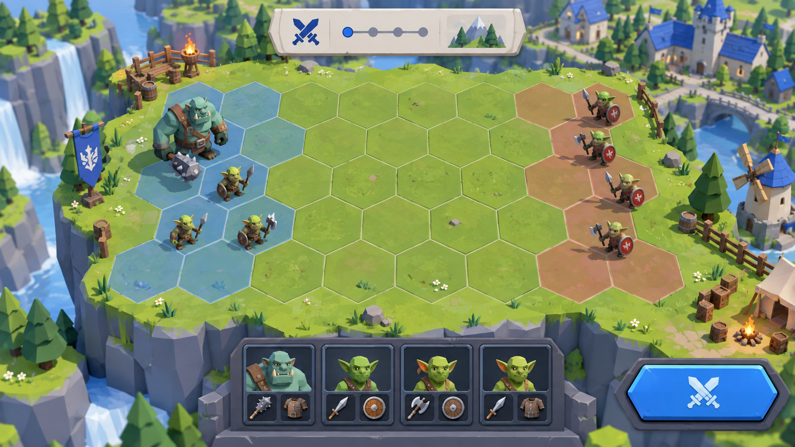
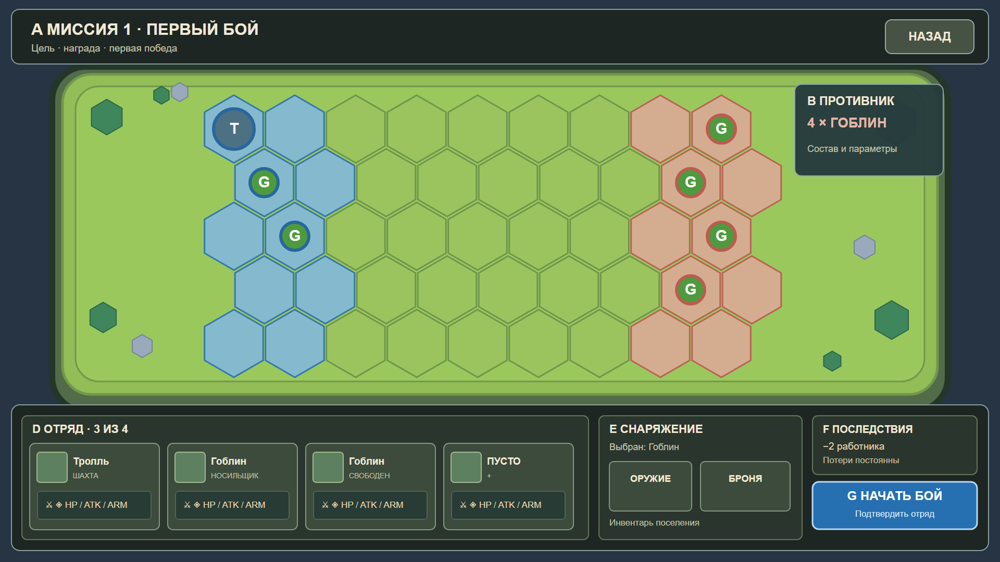
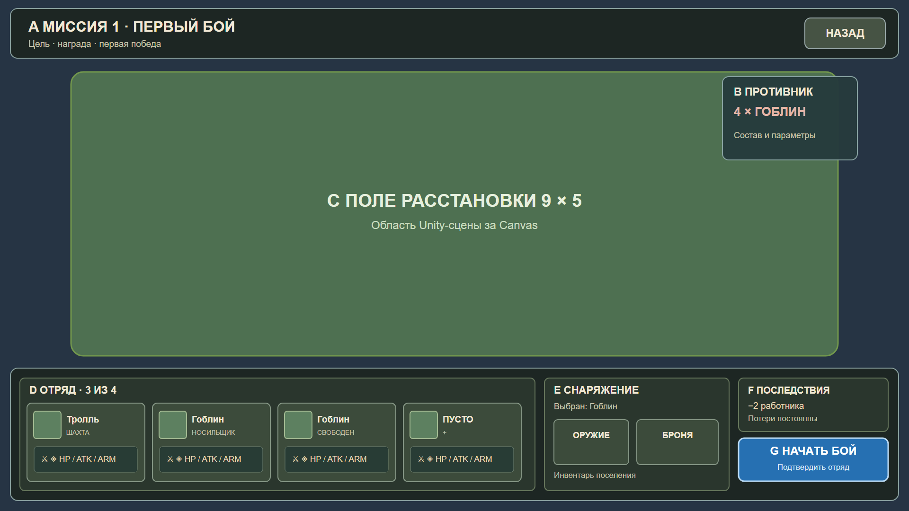

# Открытая арена — блочный макет

Основа: выбранный вариант «Открытая арена». Бой происходит в отдельной трёхмерной Unity-сцене. Референсное разрешение UI-макетов — 1920×1080; компоновка должна масштабироваться под другие соотношения сторон и размеры полей.

3D-изображение задаёт художественное направление. Блочные схемы ниже показывают размещение элементов, а не финальную геометрию или фиксированный размер арены.

## 1. Поле и окружение

| Блок | Содержание | Задача |
| --- | --- | --- |
| 3D-площадка | Объёмная земля с толстым каменным краем, деревьями, камнями и предметами окружения | Связать бой с визуальным языком поселения |
| Боевая сетка | Размеры задаёт миссия; гексы odd-r, линии и доступные зоны читаются поверх 3D-земли | Показать реальные клетки расстановки и перемещения |
| Зона игрока | Набор клеток из данных миссии; для первой — две левые колонки, синий акцент | Показать, куда можно ставить 1–4 разных живых юнитов |
| Зона врага | Набор клеток и стартовые позиции из данных миссии; для первой — две правые колонки | Показать стартовые позиции противника |
| Преграды | 3D-объекты на заданных клетках: например, крупный валун, завал или руины | Закрыть клетку для расстановки и движения; визуал совпадает с правилами |
| Бойцы | 3D-расположение на клетках; текущие спрайты или будущие объёмные модели с основанием и маркером стороны | Различать своих и врагов при отдалённой камере |
| Выбор клетки | Яркая рамка одной клетки и подсветка допустимых клеток | Подтверждать действие до запуска боя |

Поле занимает центральную часть кадра. Камера и 3D-основание подстраиваются под габариты поля, сохраняя видимость крайних клеток при открытом UI. Укрупнение поля не должно уменьшать бойцов до нечитаемого размера: для больших арен допускается управляемое приближение и перемещение камеры в подготовке. Декор не закрывает клетки и не выглядит как преграда, если не влияет на путь. Первый показанный макет — миссия 1 с полем 9×5 без преград; следующие миссии могут использовать другие размеры и клетки преград.

### Данные миссии и границы сцены

- Одна переиспользуемая добавочная сцена боя получает от приложения конфигурацию миссии и снимок отряда. Конфигурация содержит ширину, высоту, зоны расстановки, стартовые позиции врагов, преграды и ссылку на оформление окружения.
- При переходе из поселения в бой должна сохраняться **та же** `GameSession`. Сейчас `GameBootstrap.Awake` создаёт новую сессию при входе в сцену, поэтому перед реализацией перехода понадобится вынести владение сессией за пределы сцен и передавать её обоим экранам. Боевая сцена не создаёт вторую партию.
- Доменная модель проверяет, что все клетки находятся внутри поля, стартовые позиции не пересекаются с преградами и расстановка игрока использует только разрешённые клетки. Те же данные используются для расчёта пути и для построения 3D-вида.
- 3D-сцена отвечает за землю, окружение, объекты преград, бойцов, камеру, подсветку и анимацию отчёта боя. Она не решает, допустим ли ход и чем закончился бой.
- uGUI Canvas находится в этой же сцене поверх 3D-мира. Окружение и сетка не строятся из UI-блоков; схемы UI ниже показывают только их экранную область.

## 2. UI подготовки

| № | Блок | Содержание | Действие игрока |
| --- | --- | --- | --- |
| A | Верхняя панель | Название миссии; награда за победу монетой с диапазоном, первая и повторные победы в подсказке | Вернуться в колонию круглой кнопкой или Esc |
| B | Сводка врага | Портрет каждого типа врага с числом, в той же верхней панели | Оценить состав противника |
| C | 3D-поле расстановки | Зоны, поставленные юниты, свободные разрешённые клетки и непроходимые преграды | Нажать синюю клетку: встаёт боец выбранного в резерве вида. Перетащить вид из резерва на клетку: встаёт боец этого вида, а стоявший там уходит в резерв. Нажать бойца: выбрать. Перетащить: переставить или поменять местами. Унести с поля: вернуть в резерв |
| D | Резерв | Круглая кнопка с портретом на каждый вид существ колонии и число оставшихся; подсвечен вид, который встанет по клику на клетку; рядом «на поле / сколько берёт миссия». В подсказке вида: где его ставить | Выбрать, кого ставить |
| E | Снаряжение выбранного | Над отрядом, только пока боец выбран: здоровье, урон и броня картинкой с числом, предметы инвентаря круглыми кнопками, кнопка «в резерв» | Выдать, снять или передать предмет до запуска |
| F | Подсказка | Одна короткая строка под полем: что делать дальше или почему клик отклонён. Риск гибели и потери предметов в подсказке кнопки запуска | Понять следующий шаг |
| G | Запуск | Круглая кнопка авторасстановки и основная кнопка «В бой», недоступная без бойцов на поле | Подтвердить состав и расстановку одним действием |

Блоки D–G находятся в нижней панели и не перекрывают клетки. Верхняя панель остаётся компактной. Цвет не должен быть единственным признаком стороны: у союзников и врагов разные маркеры формы.

### Состояния экрана

1. **Подготовка.** Черновик расстановки не меняет поселение. Кнопка запуска активна только при 1–4 разных живых бойцах, свободных разрешённых клетках и допустимой экипировке. Преграду выбрать нельзя. Причина ошибки видна рядом с кнопкой.
2. **Воспроизведение.** Панель подготовки заменяется полосой хода боя и кнопками паузы, 1×, 2×, 4×. Команд бойцам нет. Воспроизведение читает готовый отчёт боя.
3. **Итог.** Победа, поражение или ничья; награда, погибшие и утраченные предметы; кнопка возвращения в поселение. Результат запуска применяется ровно один раз.

### Важные правила взаимодействия

- Выбор юнита в панели отряда подсвечивает его на поле. Выбор юнита на поле открывает те же данные в блоке снаряжения. Повторное нажатие или Esc снимает выбор.
- Перестановка занятости в экономике происходит только при подтверждении запуска, не при редактировании расстановки.
- Игрок выбирает вид, а не конкретное существо: бойцы одного вида в бою одинаковы, из резерва выходит следующий по списку колонии. Когда выбранный вид кончился, подсвечивается следующий вид с бойцами в резерве.
- Итоговые числа и свойства предметов приходят из игрового каталога и снимка состояния; макет не задаёт новые значения.
- Кнопка «Назад» во время подготовки отменяет только черновик. Во время воспроизведения выход с экрана не откатывает уже рассчитанный результат.

## 3. Граница текущего макета

SVG показывает расположение и относительный размер блоков на примере первого боя 9×5. Это плоская схема для обсуждения 3D-сцены, а не предложение сделать поле плоским. Портреты, иконки, финальная типографика, адаптивная раскладка и реальные данные ещё не подключены. Следующий шаг — собрать отдельную 3D-сцену боя с блочным окружением и uGUI-экраном, затем проверить минимум два размера поля и вариант с преградой.
