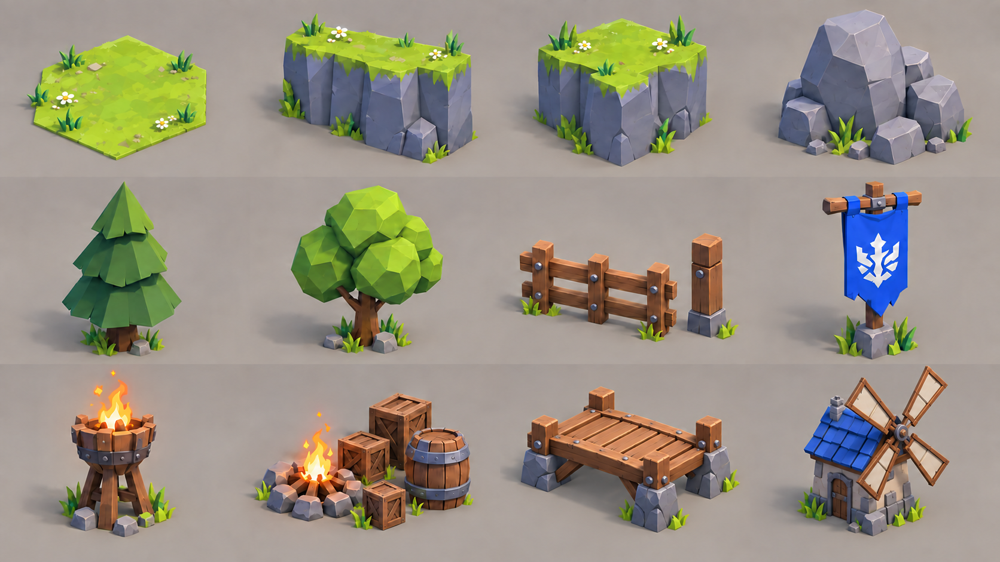

# Открытая арена — showcase моделей окружения

Это **asset showcase / model lineup**: визуальный лист отдельных моделей, а не кадр игрового интерфейса. Порядок ниже — слева направо, сверху вниз. Лист создан по выбранному концепту; он задаёт форму, палитру и относительные размеры, но не является точной технической развёрткой.

## Что изображено на листе

| № | Модель | Что делать |
| --- | --- | --- |
| 1 | Тонкая травяная поверхность гекса | Ориентир для земли. В игре это может быть процедурная поверхность; **не** делать каждую клетку отдельным высоким каменным столбом. Линии гексов и синий/красный цвет — подсветка игры, не текстура модели. |
| 2 | Прямой участок скального борта | Новый модуль периметра арены, повторяется при разной длине поля. |
| 3 | Наружный угол скального борта | Новый модуль для стыка сторон периметра. Позже можно добавить варианты формы/сколов без изменения габаритов. |
| 4 | Крупный скальный завал | **Новая игровая преграда** на одну клетку. Нужен читаемый силуэт сверху и свободное место для подсветки клетки вокруг основания. |
| 5 | Ель | Уже есть `Tree_Pine_A/B/C`; можно переиспользовать. |
| 6 | Круглое дерево | Уже есть `Tree_Round_A/B`; можно переиспользовать. |
| 7 | Секция забора с отдельной стойкой | Уже есть `Prop_Fence`; новый вариант нужен только если текущий плохо смотрится у края арены. |
| 8 | Синее знамя на столбе | Новая декоративная модель для обозначения стороны. Эмблему лучше держать сменной текстурой/материалом. |
| 9 | Жаровня | Новая декоративная модель; пламя можно добавить эффектом в Unity. |
| 10 | Костёр, ящики, бочка | Бочка и ящик уже есть `Prop_Barrel` и `Prop_Crate`. Для кадра нужен отдельный костёр; этот комплект не является игровой преградой, пока миссия явно не ставит его на занятую клетку. |
| 11 | Деревянный мост | Фоновый модуль для точного повторения кадра. Стоит за ареной и не участвует в боевой сетке. |
| 12 | Мельница с синей крышей | Фоновая модель для дальнего плана; не влияет на правила боя. |

## Приоритет изготовления

**Первый пакет для сборки 3D-сцены:** прямой участок борта, наружный угол, один скальный завал. Землю и сетку я могу временно построить средствами Unity; имеющиеся деревья, камни, заборы, бочки и ящики закроют декор. Так можно проверить поле разного размера и препятствия, не ожидая полный арт-набор.

**Второй пакет для совпадения с концептом:** знамя, жаровня, костёр, деревянный мост и мельница.

**Дальний фон кадра:** водопады, мост, домики с синей кровлей и мельница. Это оформление за ареной; оно не входит в игровую сетку. Домики и часть природы можно собрать из существующего Vitaria-набора. Мост и мельница показаны на листе; водопад нужен как эффект только если хотим повторить именно этот ракурс. Фон не должен влиять на проходимость арены.

**Не моделировать как 3D-объекты:** верхнюю панель миссии, карточки отряда, большую кнопку запуска, подсветку клеток и контуры гексов. Это UI и визуализация состояния поля в Unity.

## Контракт для передачи моделей

- Стиль: крупная низкополигональная огранка, плоское затенение, насыщенная лаймовая трава, холодный серо-синий камень, синие тканевые акценты. Сверять с текущим направлением `docs/diorama-art-direction.md`.
- Масштаб набора: 1 Blender unit = 1 метр; пивот предмета внизу по центру, геометрия над локальным `Z=0`. При экспорте FBX придерживаться настроек существующего Vitaria-набора.
- Временный ориентир боевой клетки: гекс около 2 м между параллельными сторонами. Завал должен помещаться внутри одной клетки с небольшим зазором по контуру. Окончательный масштаб проверим в Unity-блок-ауте до изготовления вариантов.
- Борт делать модульным: повторяемый прямой участок и угол со стыкуемыми концами. Размер поля меняется между миссиями, поэтому цельный остров фиксированного размера не подходит.
- Игровой завал должен быть отдельным объектом с понятным основанием; дерево, трава и мелкие камни вокруг поля могут оставаться декором без коллайдера. Статус преграды задаёт миссия, а не наличие произвольной модели на сцене.
- Для передачи достаточно `.blend`, экспортированного `.fbx` и одного превью на модель или пакет. Исходники сохраняются отдельно от Unity-импорта, как у Vitaria-набора.

## Первый конкретный handoff

Сначала достаточно трёх FBX: `Battle_Cliff_Straight`, `Battle_Cliff_OuterCorner`, `Battle_Obstacle_Rock_01`. Я проверю их на полях двух размеров, затем можно делать варианты декора и дальнего фона без риска переделывать всю арену.
