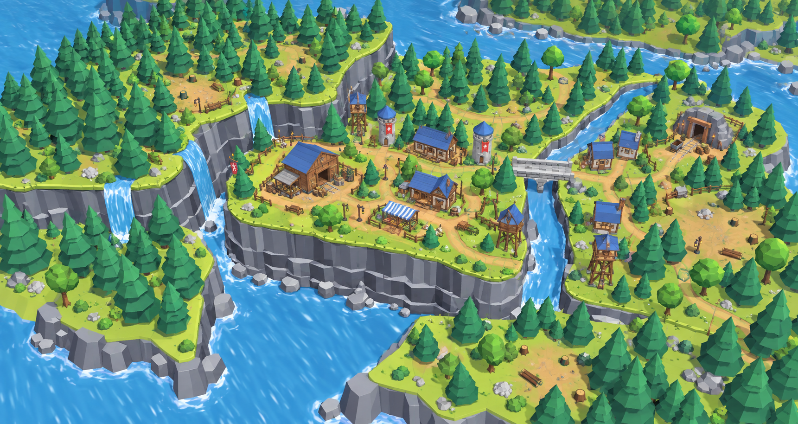
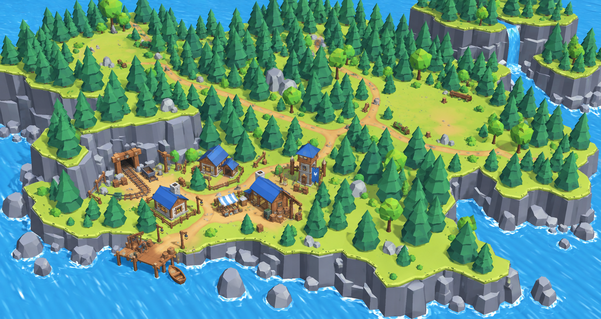
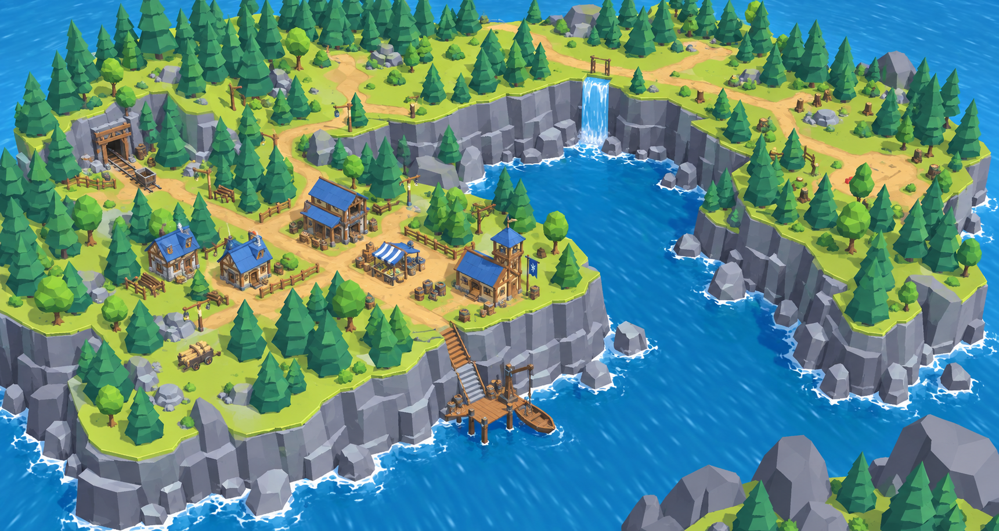
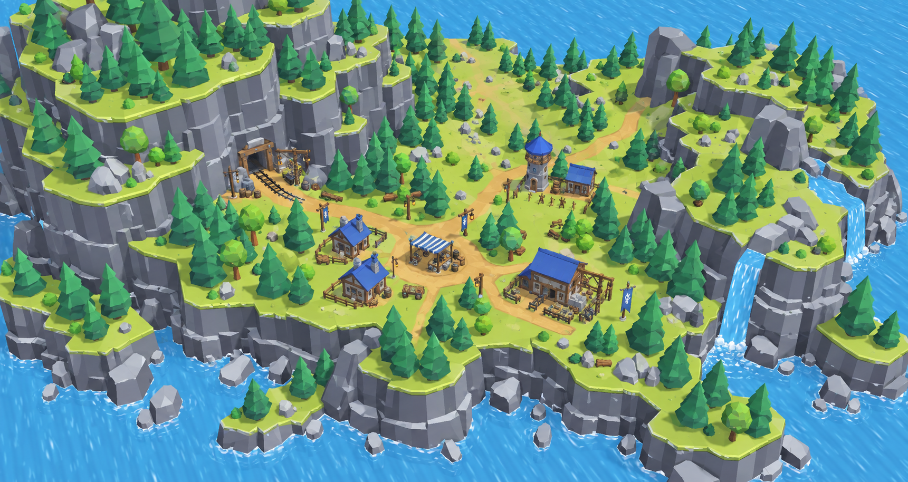

# Colony island concepts — revision 2

Generated with the built-in image_gen tool using the user's arena screenshot as reference. These are visual concepts, not Unity scene captures.

Revision: remove plot overlays, bring the colony closer to the camera, reduce empty land and give each location a distinct composition.

## 1 — поселение на уступе

### Generation prompt

Use case: stylized-concept. Produce ONE landscape concept image for the main colony location of the user's TrollStrategy game. The supplied image is the exact visual style and environment-language reference. The previous concepts were rejected because they looked like enormous empty geometric lawns bordered by a ring of trees, with tiny houses and nearly identical silhouettes. Correct that failure decisively. Match this specific Unity scene: coarse straight-edged polygonal grey/slate cliffs with long irregular vertical faces and layered horizontal shelves, thin yellow-green grassy caps, simple angular teal conifers with distinct tiered canopies, angular round green trees, warm ochre dirt paths, modest timber buildings with plain blue roofs, simple diffuse materials, natural clear game daylight. Do not redesign this into a polished generic mobile city-builder, smooth toy render, photorealism or painterly fantasy illustration. View from the same high oblique game-camera angle as the reference; fill the frame with land and scenery, with blue water underneath and around visible cliff edges, NOT a small centered island icon in a vast sea. Create an attractive living COLONY, remove the arena/combat subject entirely. Use a coherent compact cluster of about six modest functional buildings: warehouse, barracks, two small timber houses, market canopy and mine entrance; add purposeful small groups of carts, crates, barrels, fences and lanterns around doors. Buildings should be comparable in relative screen size to the buildings in the reference, not miniature specks. Let dirt paths link the cluster and branch naturally into the landscape. Keep two or three modest expansion clearings embedded naturally in a varied environment, around 25–35% of the visible land total. These future areas still have low ground cover and scattered removable trees; don't depict them as blank purchased squares. Buildable clearings connect by generous land corridors. The landscape must have foreground, middle ground and background depth, strongly asymmetrical large masses, irregular forest clusters with gaps, cliff promontories, ledges and sheltered corners. A different island silhouette and organization in each concept, not just relocating a waterfall. Show ordinary game appearance: NO gold lines, dotted or dashed borders, subdivision outlines, grids, hexes, combat units, ownership overlays, labels, HUD, editor grid or gizmos. No huge empty center, no uniform lawn, no round island with an evenly planted forest perimeter.
COMPOSITION A: DIRECT ENVIRONMENT ADAPTATION OF THE REFERENCE. Preserve the reference's recognizable asymmetric organization: a massive densely forested high grey cliff ridge at the back-left, water spilling through a cleft beside it, a much smaller central-front grassy rocky ledge, and the wooded stream bank and modest blue-roof structures at the right. On the former combat ledge remove every hexagon and fighter and arrange the compact six-building colony with winding paths and small lived-in yards across most of that ledge. Two natural unbuilt clearings for future development appear on the adjoining right-hand bank and rear land shelf, connected by land routes behind the stream. Keep the waterfall and long layered cliff front, scattered rocks at water level and the original forest's uneven depth. The map should feel like the attached arena environment repurposed into a colony, with much the same density and existing-asset rough simplicity. Replace the grey editor backdrop with continuation of water and scenery, no floating diorama presentation.

## 2 — три лесные поляны

### Generation prompt

Use case: stylized-concept. Produce ONE landscape concept image for the main colony location of the user's TrollStrategy game. The supplied image is the exact visual style and environment-language reference. The previous concepts were rejected because they looked like enormous empty geometric lawns bordered by a ring of trees, with tiny houses and nearly identical silhouettes. Correct that failure decisively. Match this specific Unity scene: coarse straight-edged polygonal grey/slate cliffs with long irregular vertical faces and layered horizontal shelves, thin yellow-green grassy caps, simple angular teal conifers with distinct tiered canopies, angular round green trees, warm ochre dirt paths, modest timber buildings with plain blue roofs, simple diffuse materials, natural clear game daylight. Do not redesign this into a polished generic mobile city-builder, smooth toy render, photorealism or painterly fantasy illustration. View from the same high oblique game-camera angle as the reference; fill the frame with land and scenery, with blue water underneath and around visible cliff edges, NOT a small centered island icon in a vast sea. Create an attractive living COLONY, remove the arena/combat subject entirely. Use a coherent compact cluster of about six modest functional buildings: warehouse, barracks, two small timber houses, market canopy and mine entrance; add purposeful small groups of carts, crates, barrels, fences and lanterns around doors. Buildings should be comparable in relative screen size to the buildings in the reference, not miniature specks. Let dirt paths link the cluster and branch naturally into the landscape. Keep two or three modest expansion clearings embedded naturally in a varied environment, around 25–35% of the visible land total. These future areas still have low ground cover and scattered removable trees; don't depict them as blank purchased squares. Buildable clearings connect by generous land corridors. The landscape must have foreground, middle ground and background depth, strongly asymmetrical large masses, irregular forest clusters with gaps, cliff promontories, ledges and sheltered corners. A different island silhouette and organization in each concept, not just relocating a waterfall. Show ordinary game appearance: NO gold lines, dotted or dashed borders, subdivision outlines, grids, hexes, combat units, ownership overlays, labels, HUD, editor grid or gizmos. No huge empty center, no uniform lawn, no round island with an evenly planted forest perimeter.
COMPOSITION B: THREE FOREST CLEARINGS. A broad irregular rocky island landscape with three differently shaped modest clearings on one connected land surface, offset diagonally through deep uneven forest masses. In the nearest left clearing, a developed compact colony hugs a grey rock outcrop containing the mine. The second clearing lies to the upper right along a winding ochre path and is grassland with a few scattered trees; the third is a narrower meadow toward the left rear beyond a broken stand of pines. These are natural clearings, not squares or round manicured lawns; broad land links between them. The foreground coast has a low cove and rocks, the right rear has a tall forested cliff with one narrow waterfall. Forest extends into the interior in organic patches and small rock groups break up the land. A close game camera shows the village clearly while revealing directions of growth. Distinct silhouette from reference: no giant single central plateau or perfectly enclosing horseshoe cliff.

## 3 — поселение у глубокой бухты

### Generation prompt

Use case: stylized-concept. Produce ONE landscape concept image for the main colony location of the user's TrollStrategy game. The supplied image is the exact visual style and environment-language reference. The previous concepts were rejected because they looked like enormous empty geometric lawns bordered by a ring of trees, with tiny houses and nearly identical silhouettes. Correct that failure decisively. Match this specific Unity scene: coarse straight-edged polygonal grey/slate cliffs with long irregular vertical faces and layered horizontal shelves, thin yellow-green grassy caps, simple angular teal conifers with distinct tiered canopies, angular round green trees, warm ochre dirt paths, modest timber buildings with plain blue roofs, simple diffuse materials, natural clear game daylight. Do not redesign this into a polished generic mobile city-builder, smooth toy render, photorealism or painterly fantasy illustration. View from the same high oblique game-camera angle as the reference; fill the frame with land and scenery, with blue water underneath and around visible cliff edges, NOT a small centered island icon in a vast sea. Create an attractive living COLONY, remove the arena/combat subject entirely. Use a coherent compact cluster of about six modest functional buildings: warehouse, barracks, two small timber houses, market canopy and mine entrance; add purposeful small groups of carts, crates, barrels, fences and lanterns around doors. Buildings should be comparable in relative screen size to the buildings in the reference, not miniature specks. Let dirt paths link the cluster and branch naturally into the landscape. Keep two or three modest expansion clearings embedded naturally in a varied environment, around 25–35% of the visible land total. These future areas still have low ground cover and scattered removable trees; don't depict them as blank purchased squares. Buildable clearings connect by generous land corridors. The landscape must have foreground, middle ground and background depth, strongly asymmetrical large masses, irregular forest clusters with gaps, cliff promontories, ledges and sheltered corners. A different island silhouette and organization in each concept, not just relocating a waterfall. Show ordinary game appearance: NO gold lines, dotted or dashed borders, subdivision outlines, grids, hexes, combat units, ownership overlays, labels, HUD, editor grid or gizmos. No huge empty center, no uniform lawn, no round island with an evenly planted forest perimeter.
COMPOSITION C: DEEP COVE. Strongly asymmetrical L-shaped connected rocky island wraps a deep rich blue bay running diagonally into the scene from the lower right. The near-left grassy headland holds the colony, its buildings organized along an ochre road near a tall grey cliff with lower rock shelves. A modest timber landing sits at the base of the cliff connected by a short stair. The second arm of the island is a stony wooded headland across the bay and is visually substantial, not a token fringe. Broad continuous land at the back of the bay joins both arms. Future settlement clearings lie along the gently curving rear road, interspersed with irregular pines and rock outcrops; no empty rectangular expanse. One small waterfall on the far cliff, foreground rock silhouettes and white water at cliff foot. Sea and bay form a central compositional shape while the colony is large enough to read. Keep buildings rustic and small-scale, no big city, fleet, grand port or castles.

## 4 — долина между скалами

### Generation prompt

Use case: stylized-concept. Produce ONE landscape concept image for the main colony location of the user's TrollStrategy game. The supplied image is the exact visual style and environment-language reference. The previous concepts were rejected because they looked like enormous empty geometric lawns bordered by a ring of trees, with tiny houses and nearly identical silhouettes. Correct that failure decisively. Match this specific Unity scene: coarse straight-edged polygonal grey/slate cliffs with long irregular vertical faces and layered horizontal shelves, thin yellow-green grassy caps, simple angular teal conifers with distinct tiered canopies, angular round green trees, warm ochre dirt paths, modest timber buildings with plain blue roofs, simple diffuse materials, natural clear game daylight. Do not redesign this into a polished generic mobile city-builder, smooth toy render, photorealism or painterly fantasy illustration. View from the same high oblique game-camera angle as the reference; fill the frame with land and scenery, with blue water underneath and around visible cliff edges, NOT a small centered island icon in a vast sea. Create an attractive living COLONY, remove the arena/combat subject entirely. Use a coherent compact cluster of about six modest functional buildings: warehouse, barracks, two small timber houses, market canopy and mine entrance; add purposeful small groups of carts, crates, barrels, fences and lanterns around doors. Buildings should be comparable in relative screen size to the buildings in the reference, not miniature specks. Let dirt paths link the cluster and branch naturally into the landscape. Keep two or three modest expansion clearings embedded naturally in a varied environment, around 25–35% of the visible land total. These future areas still have low ground cover and scattered removable trees; don't depict them as blank purchased squares. Buildable clearings connect by generous land corridors. The landscape must have foreground, middle ground and background depth, strongly asymmetrical large masses, irregular forest clusters with gaps, cliff promontories, ledges and sheltered corners. A different island silhouette and organization in each concept, not just relocating a waterfall. Show ordinary game appearance: NO gold lines, dotted or dashed borders, subdivision outlines, grids, hexes, combat units, ownership overlays, labels, HUD, editor grid or gizmos. No huge empty center, no uniform lawn, no round island with an evenly planted forest perimeter.
COMPOSITION D: ROCKY SADDLE. A single connected island with a broad navigable gently level land corridor between two very different large grey cliff formations. On the left a tall steep forest-capped layered massif dominates the background; on the right a lower exposed broken rocky shoulder curves toward the sea. The colony occupies a modest front-center clearing, with the mine cut into the LEFT massif and the timber warehouses and barracks along branching earth tracks. Expansion land appears as two irregular natural clearings receding between the rock masses, with sparse young conifers and bushes rather than bare turf. A stream cascades down the OUTER right shoulder into surrounding water; it does not divide the colony corridor. Front coast jagged, visible staggered ledges below the land, low rocks and some pines in the foreground. The sightline into the saddle gives depth and a reason to explore; make this notably rockier and more enclosed than the other three while using the exact simple low-poly reference style.
