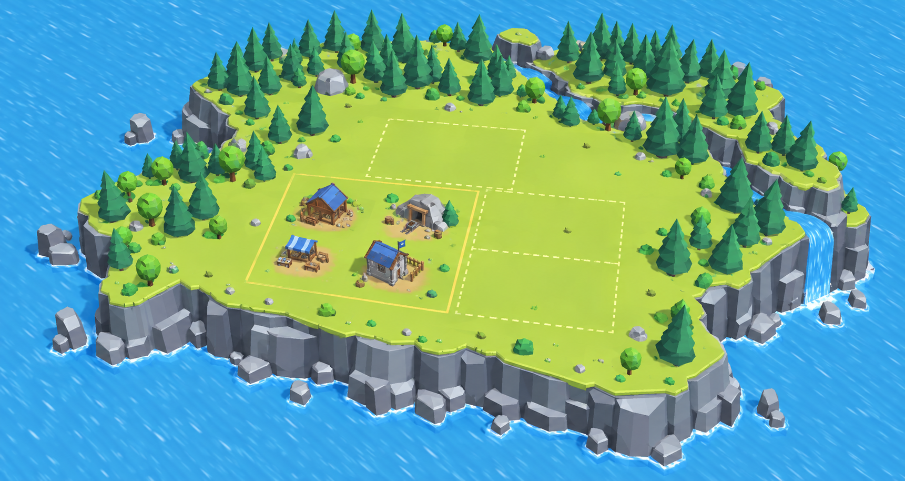
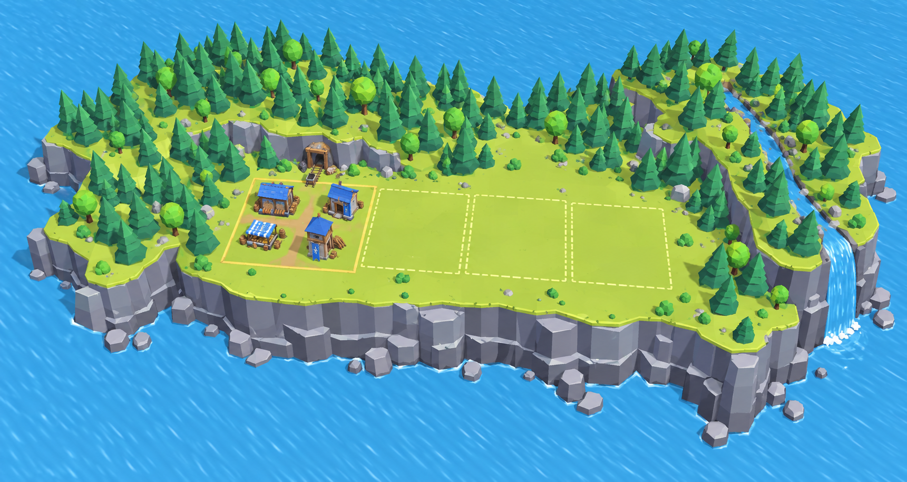
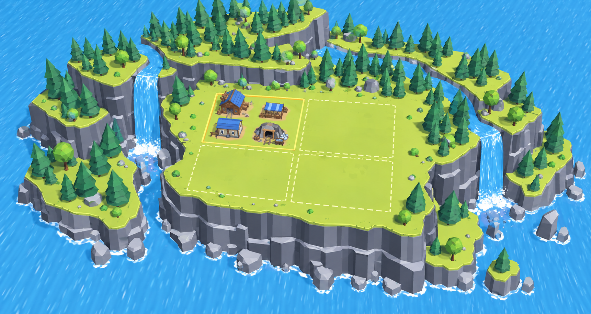
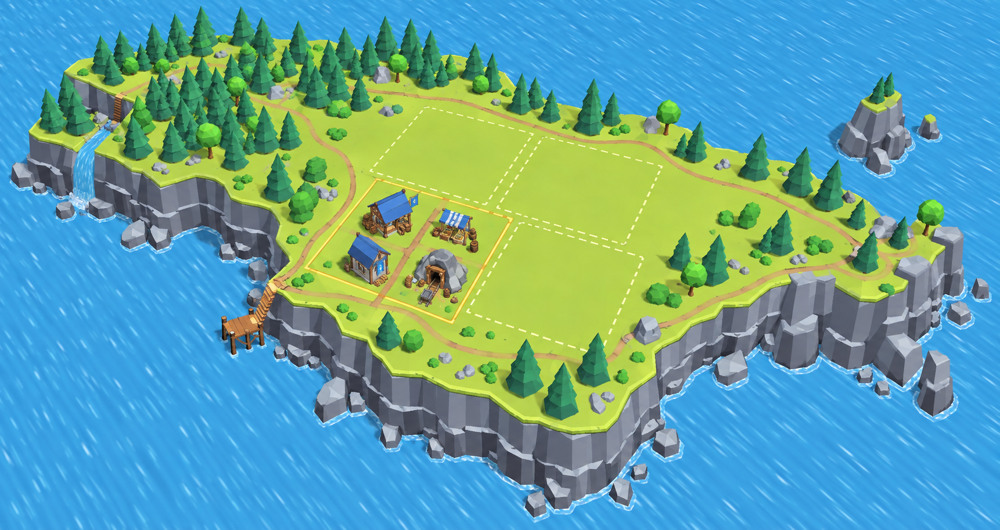

# Colony island concepts — 2026-09-27

Generated with the built-in image_gen tool. Visual concepts for discussion; not Unity scene captures.

Style reference: the user's arena screenshot. Gold outlines show the starting plot; dashed outlines suggest expansion plots.

## Вариант 1 — широкое плато

### Generation prompt

Use case: stylized-concept. Asset type: visual proposal for TrollStrategy's expandable colony map, ONE landscape game-environment image per call. Input image is a STYLE REFERENCE ONLY, not an edit target. Faithfully match its actual Unity low-poly geometry, scale, bright lime/chartreuse grass, faceted dark teal conifers and angular green deciduous trees, cold grey-blue stratified cliff faces, warm wood and cobalt blue building roofs, flat simple palette materials, clear directional daylight and soft game shadows. This should look achievable with the exact existing asset kit, not a hand-painted illustration, photoreal scene, voxel world or highly detailed fantasy city. Render a high three-quarter overhead strategy-camera view, similar to the reference, showing the entire island and broad blue water surrounding it, horizon absent. Sharp clean polygon edges. Colony instead of battle arena: a compact starting settlement with just four modest structures: timber warehouse with blue roof, market stall with blue canopy, blue-roofed barracks and mine entrance with small cart. Wide flat connected grassy land for many future buildings; land is mostly unbuilt. Buildings occupy about one eighth of the buildable land. Make the proposed purchasable expansion understandable: on the continuous flat plateau show ONE very subtle warm golden square border around the starting colony, and three adjacent broad empty expansion plots indicated by faint dashed cream square outlines lying flat on the ground, sharing full edges; no small cell grid. These are overlay markings only: terrain and roads stay continuous across them, no walls or raised block edges between plots. Keep scenery and tall trees outside expansion plots. All building plots at one common height; higher land is decorative beyond them. An irregular natural coast with tall faceted grey-blue cliffs drops to the surrounding water. No arena, hexagons, colored combat zones, fighters, editor grid, editor icons, HUD, labels, text or watermarks. Wide landscape framing.
Design 1: BROAD ROCKY PLATEAU. A single substantial compact rounded-square island with a large uninterrupted lawn across its center, irregular faceted cliff coast, scattered rock ledges at water level. Starting settlement toward front-left of the central land; open purchasable plots expand right and backward. Evergreen woods clustered along the rear coast, one small stream confined to the rear decorative skirt and one waterfall off the right outer coast. Simple bold composition, largest contiguous building space of the four variants, very close to the reference arena's rocky plateau language.

## Вариант 2 — лесная долина

### Generation prompt

Use case: stylized-concept. Asset type: visual proposal for TrollStrategy's expandable colony map, ONE landscape game-environment image per call. Input image is a STYLE REFERENCE ONLY, not an edit target. Faithfully match its actual Unity low-poly geometry, scale, bright lime/chartreuse grass, faceted dark teal conifers and angular green deciduous trees, cold grey-blue stratified cliff faces, warm wood and cobalt blue building roofs, flat simple palette materials, clear directional daylight and soft game shadows. This should look achievable with the exact existing asset kit, not a hand-painted illustration, photoreal scene, voxel world or highly detailed fantasy city. Render a high three-quarter overhead strategy-camera view, similar to the reference, showing the entire island and broad blue water surrounding it, horizon absent. Sharp clean polygon edges. Colony instead of battle arena: a compact starting settlement with just four modest structures: timber warehouse with blue roof, market stall with blue canopy, blue-roofed barracks and mine entrance with small cart. Wide flat connected grassy land for many future buildings; land is mostly unbuilt. Buildings occupy about one eighth of the buildable land. Make the proposed purchasable expansion understandable: on the continuous flat plateau show ONE very subtle warm golden square border around the starting colony, and three adjacent broad empty expansion plots indicated by faint dashed cream square outlines lying flat on the ground, sharing full edges; no small cell grid. These are overlay markings only: terrain and roads stay continuous across them, no walls or raised block edges between plots. Keep scenery and tall trees outside expansion plots. All building plots at one common height; higher land is decorative beyond them. An irregular natural coast with tall faceted grey-blue cliffs drops to the surrounding water. No arena, hexagons, colored combat zones, fighters, editor grid, editor icons, HUD, labels, text or watermarks. Wide landscape framing.
Design 2: FOREST VALLEY ISLAND. A single connected elongated rocky island over water, with an inviting broad flat settlement clearing embraced by decorative forested higher slopes in a loose U shape at the back and sides. Dense angular conifers and a few rounded faceted deciduous trees on the perimeter hills, much lower vegetation in front. Four contiguous level expansion plots fill the sunny central valley and extend toward the front coast. A small creek runs along the far outer right edge and cascades off the cliff without crossing the construction plots. More sheltered and green than the broad plateau; houses remain small and the land remains mostly empty. Tall exterior coastal cliff face visible at front.

## Вариант 3 — остров с водопадами

### Generation prompt

Use case: stylized-concept. Asset type: visual proposal for TrollStrategy's expandable colony map, ONE landscape game-environment image per call. Input image is a STYLE REFERENCE ONLY, not an edit target. Faithfully match its actual Unity low-poly geometry, scale, bright lime/chartreuse grass, faceted dark teal conifers and angular green deciduous trees, cold grey-blue stratified cliff faces, warm wood and cobalt blue building roofs, flat simple palette materials, clear directional daylight and soft game shadows. This should look achievable with the exact existing asset kit, not a hand-painted illustration, photoreal scene, voxel world or highly detailed fantasy city. Render a high three-quarter overhead strategy-camera view, similar to the reference, showing the entire island and broad blue water surrounding it, horizon absent. Sharp clean polygon edges. Colony instead of battle arena: a compact starting settlement with just four modest structures: timber warehouse with blue roof, market stall with blue canopy, blue-roofed barracks and mine entrance with small cart. Wide flat connected grassy land for many future buildings; land is mostly unbuilt. Buildings occupy about one eighth of the buildable land. Make the proposed purchasable expansion understandable: on the continuous flat plateau show ONE very subtle warm golden square border around the starting colony, and three adjacent broad empty expansion plots indicated by faint dashed cream square outlines lying flat on the ground, sharing full edges; no small cell grid. These are overlay markings only: terrain and roads stay continuous across them, no walls or raised block edges between plots. Keep scenery and tall trees outside expansion plots. All building plots at one common height; higher land is decorative beyond them. An irregular natural coast with tall faceted grey-blue cliffs drops to the surrounding water. No arena, hexagons, colored combat zones, fighters, editor grid, editor icons, HUD, labels, text or watermarks. Wide landscape framing.
Design 3: WATERFALL TERRACE ISLAND. A single large connected island, dramatically faceted tall front and side cliffs and two broad blue waterfalls falling into the surrounding water. The main settlement and all four contiguous expansion plots are on one wide FLAT middle terrace. Rear decorative land rises in two rocky forested steps above the main plateau, patterned after the layered heights in the supplied arena screenshot. Streams and higher steps stay behind and beside the playable rectangle, never cut it. Rocks at cliff foot, saturated water with modest white foam. Most spectacular vertical silhouette but preserve a broad uncluttered buildable lawn; no villages on separate little islands or fantasy towers.

## Вариант 4 — прибрежный мыс

### Generation prompt

Use case: stylized-concept. Asset type: visual proposal for TrollStrategy's expandable colony map, ONE landscape game-environment image per call. Input image is a STYLE REFERENCE ONLY, not an edit target. Faithfully match its actual Unity low-poly geometry, scale, bright lime/chartreuse grass, faceted dark teal conifers and angular green deciduous trees, cold grey-blue stratified cliff faces, warm wood and cobalt blue building roofs, flat simple palette materials, clear directional daylight and soft game shadows. This should look achievable with the exact existing asset kit, not a hand-painted illustration, photoreal scene, voxel world or highly detailed fantasy city. Render a high three-quarter overhead strategy-camera view, similar to the reference, showing the entire island and broad blue water surrounding it, horizon absent. Sharp clean polygon edges. Colony instead of battle arena: a compact starting settlement with just four modest structures: timber warehouse with blue roof, market stall with blue canopy, blue-roofed barracks and mine entrance with small cart. Wide flat connected grassy land for many future buildings; land is mostly unbuilt. Buildings occupy about one eighth of the buildable land. Make the proposed purchasable expansion understandable: on the continuous flat plateau show ONE very subtle warm golden square border around the starting colony, and three adjacent broad empty expansion plots indicated by faint dashed cream square outlines lying flat on the ground, sharing full edges; no small cell grid. These are overlay markings only: terrain and roads stay continuous across them, no walls or raised block edges between plots. Keep scenery and tall trees outside expansion plots. All building plots at one common height; higher land is decorative beyond them. An irregular natural coast with tall faceted grey-blue cliffs drops to the surrounding water. No arena, hexagons, colored combat zones, fighters, editor grid, editor icons, HUD, labels, text or watermarks. Wide landscape framing.
Design 4: COASTAL PENINSULA ISLAND. A single asymmetrical connected island shaped like a broad curved headland, water wrapping around a shallow bay on the left and a bold high rocky prow on the right. Main grass top is broad and level, with four edge-adjacent spacious expansion plots stretching diagonally across the large central headland; don't rotate the square plot grid relative to itself. Starting village near front-center; golden plot line around it. Forest masses at rear-left, exposed rock and sparse shrubs toward the sea-facing right tip. One simple small wooden landing platform at cliff foot in the bay, connected to the outside coast by a decorative narrow stair, no large harbor or ships. A dirt footpath winds around the perimeter, buildable interior empty. Emphasize asymmetric coastline and sea views, while retaining the same grass, trees, buildings and cliff style as reference.
